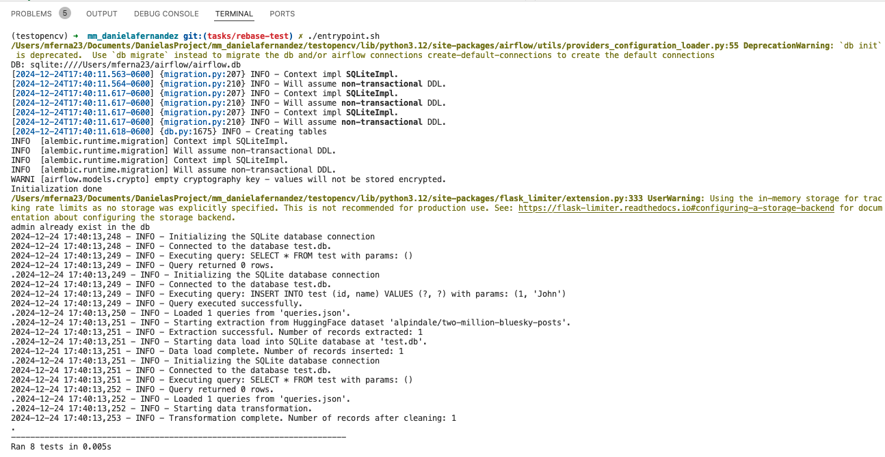
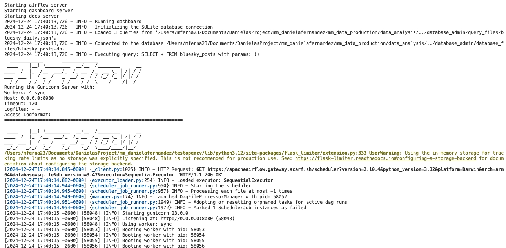
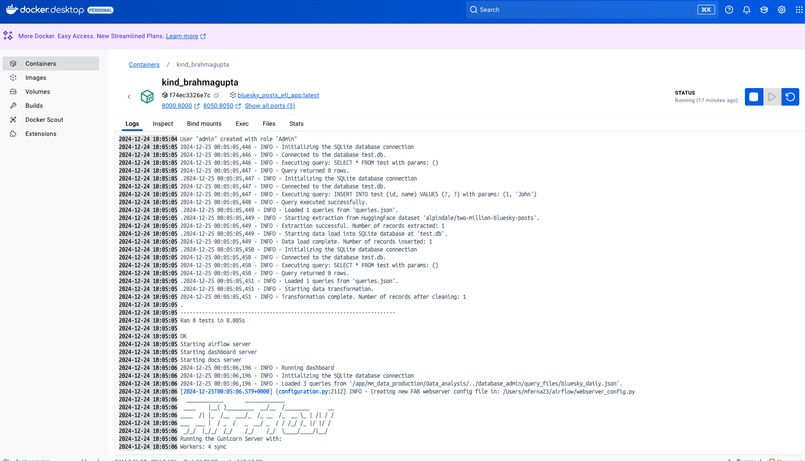
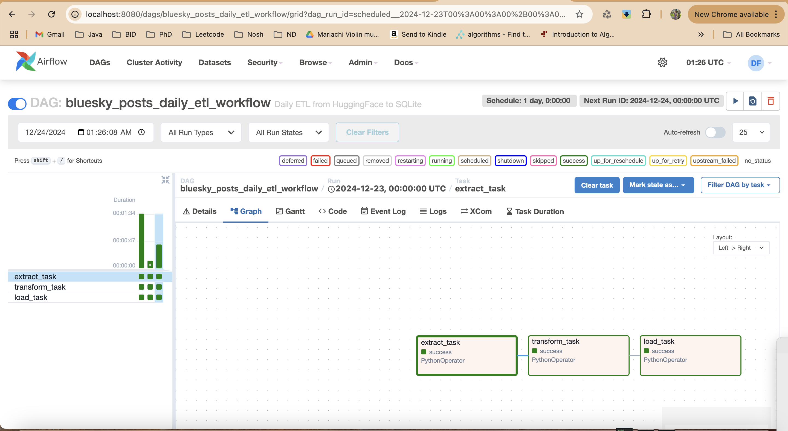
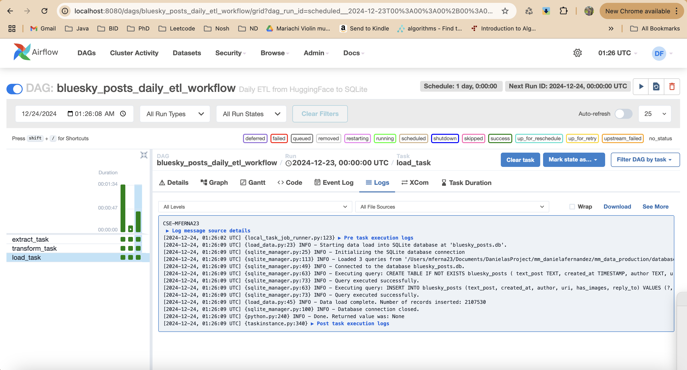
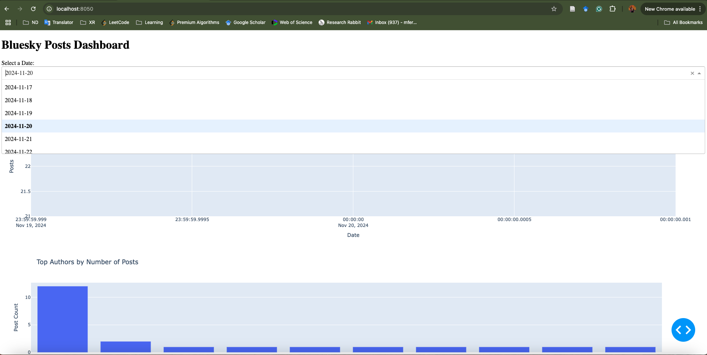
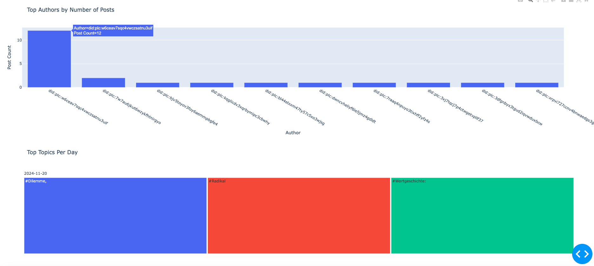
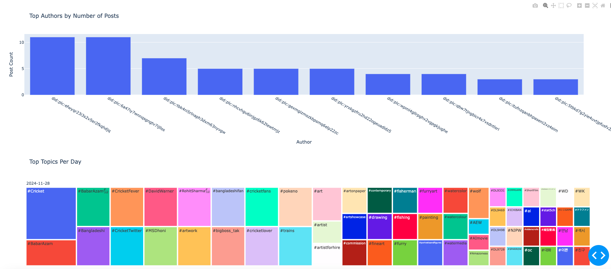
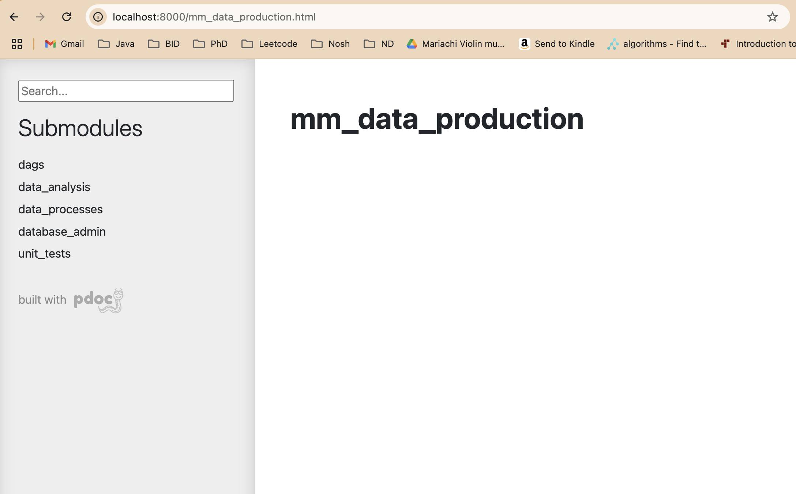
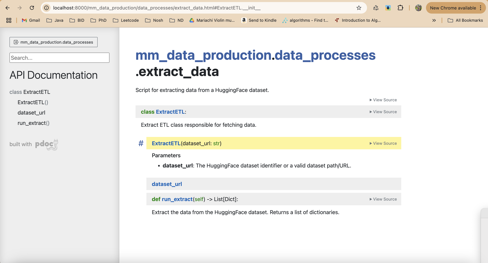

# BlueSky Posts ETL Pipeline and Dashboard

A project to process, analyze, and visualize posts from the [BlueSky dataset](https://huggingface.co/datasets/alpindale/two-million-bluesky-posts). This project includes an ETL pipeline built with Apache Airflow and a data visualization dashboard using Dash and Plotly.

---

## 📄 Description

This project implements:
- **ETL Pipeline**: Extracts data from HuggingFace, cleans it, and loads it into SQLite.
- **Dashboard**: Analyzes posts per day, top authors, and trending topics.
- **Unit Test**: Performs 8 unit tests to ensure the functionality of the app

---

## 🛠️ Features

- **Daily Automation**: Automatically processes data using Airflow.
- **Data Visualization**: Interactive dashboards built with Dash.
- **Modular Design**: Reusable and testable ETL components.

---

## 🏗️ Directory Structure

## Project Structure

```plaintext
mm_danielafernandez/
├── mm_data_production/
│   ├── dags/                           # Airflow DAGs
│   │   ├── bluesky_posts.py            # Daily DAG to perform ETL process
│   │   ├── bluesky_posts_daily.py      # Test DAG (please ignore)
│   ├── data_processes/                 # ETL components
│   │   ├── extract_data.py
│   │   ├── transform_data.py
│   │   ├── load_data.py
│   ├── database_admin/                 # SQLite management
│   │   ├── sqlite_manager.py
│   │   ├── query_files/
│   │   │   ├── bluesky_daily.json
│   ├── visualization/                  # Dash app for visualization
│   │   ├── bluesky_dashboard.py
│   ├── tests/                          # Unit tests
│   │   ├── test_extract_data.py
│   │   ├── test_transform_data.py
│   │   ├── test_load_data.py
├── requirements.txt                    # Dependencies
├── airflow.cfg                         # Airflow config file
├── README.md                           # Documentation
```

---

## 🚀 Installation

### Prerequisites
- Python 3.8 or later
- SQLite
- Apache Airflow
- Dash

### Steps

<h3>Option 1 - Running .sh script</h3>

1. **Clone the Repository**:
   ```bash
   git clone https://github.com/your-username/bluesky-etl-dash.git
   cd bluesky-etl-dash
   ```

2. **Set Up a Virtual Environment**:
   ```bash
    python -m venv venv
    source venv/bin/activate  # Windows: venv\Scripts\activate
   ```

3. **Set Up a Virtual Environment**:
   ```bash
    pip install -r requirements.txt
   ```

4. **Configure Airflow**:
- Start the database
     ```bash
    airflow init
   ```  
- Create an admin user:
     ```bash
    airflow users create --username admin --password admin --firstname Admin --lastname User --role Admin --email admin@example.com
   ```  

- Update airflow.cfg to set your DAGs folder -> mm_danielafernandez/mm_data_production/dags
     ```bash
    dags_folder = /absolute/path/to/src/dags
   ```  

- Run entry_point.sh
     ```bash
    ./entrypoint.sh 
   ```  

- On the terminal, you should see the following logs




- On your browser, open airflow UI, dashboard, and docs
     ```bash
    http://localhost:8080 -- airflow
    http://localhost:8050 -- dashboard
    http://localhost:8000 -- docs 
   ``` 

<h3>Option 2 - Running Docker image</h3>

- Clone the repository
   ```bash
   git clone https://github.com/your-username/bluesky-etl-dash.git
   cd bluesky-etl-dash
   ```

- Locate the local project where you cloned the repository, and build the Docker image
   ```bash
   docker build -t <image-name> .
   ```


- 	Run the Docker container:
    ```bash
    docker run -p <host-port>:<container-port> <image-name>
    ```

- On the docker desktop
  - Go to the images section to confirm the image was created. You can click on the play button to run the container from the image

    
  
  - Go to the containers section to confirm the container is running

    

  - Click on the container to see the logs
     

<h4>Notes</h4>

To stop the application, stop the container and make sure ports are available for future processes by running

   ```bash
    lsof -i :8000
    kill -9 <pid>
   ```

## 📊 Usage

<h3>Run Unit Tests</h3>

1.  Run all the unit tests
    ```bash
        python -m unittest discover ./mm_data_production/unit_tests
    ```

<h3>Run the ETL Pipeline</h3>

1.  Start the Airflow webserver and scheduler:

    ```bash
        airflow webserver --port 8080
        airflow scheduler
    ```  
    
2.  Access the Airflow UI at http://localhost:8080.
3.  Trigger the bluesky_posts_daily_etl_workflow DAG.

<h3>Run the Visualization Dashboard</h3>

1.  Start the Dash app:
    ```bash
        python ./mm_data_production/data_analysis/ds_bluesky_posts.py
    ```
    
2.  Open your browser and go to http://localhost:8050

<h3>Review the docs</h3>

1.  Take a look at the docs
    ```bash
        python ./serve_docs.py
    ```
2. Open your browser and go to http://127.0.0.1:8000/mm_data_production.html


Please refer to this video to observe the app functionality and usage

[Watch the video on YouTube](https://youtu.be/uExImnHSYmk)

        
## 📸 Screenshots
<h3>Airflow</h3>
1. Access the Airflow UI at http://localhost:8080 . After logging in, you will be redirected to airflow/home. You will see two dags, bluesky_posts_daily is a test, please ignore.


2. Click on the DAG bluesky_posts_daily_etl_workflow to check the ETL process for bluesky_posts.



3. Click on individual tasks to monitor the progress




<h3>Dashboard</h3>
1. Access the Dashboard at http://localhost:8050. This dashboard has 3 tiles: posts per day, top 10 users (users with most post), top topics (most used hashtags)


2. Select a date at the top to get daily details



3. The graphs will display data for the specific date

November, 20, 2024


November, 28, 2024


<h3>Docs</h3>
1. Access the Docs at http://localhost:8000. As mentioned above, the project has different sections. The project is called mm_data_production, it has 5 submodules: 1) dags - airflow dags, 2) data analysis - scripts for data visaulizations, 3) data processes - scripts for extracting, transforming, and loading data, 4) data admin - database files, query files, data manager script, 5) unit tests



2. Click on the different submodules for more details



## 📊 Data Insights

After exploring the BlueSky dataset, these are some key insights
- The dataset has 2,107,530 records
- Posts go from October, 15, 2007 to November, 30, 2024
- The major number of posts can be observed on November, 27, 2024
- The most popular topics on November, 27, 2024 were:
  - #music
  - #musicsocial
  - #omarapollo
  - youtube
- The user with most posts published on November, 27, 2024 was:
  - did:plc:yda52huz5pys4jmmzfxlztm
- Before 2024, the usage of # (trend topics) is limited
- 17% of the posts have a reply

## 💡 Acknowledgments
	- Data sourced from BlueSky Dataset.
	- Built with Apache Airflow, Dash, and SQLite.
